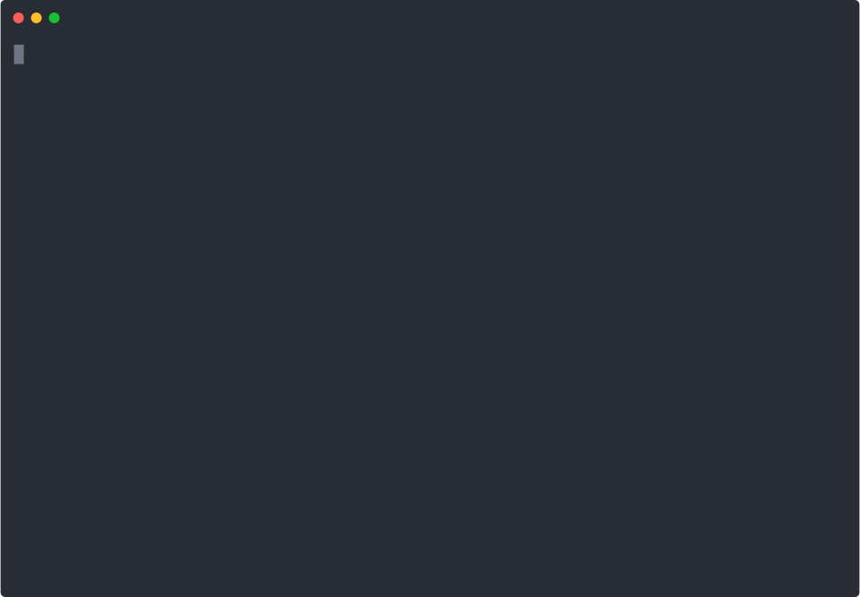

# lambda-lifeline

> Scan, upgrade, test, and safely deploy your AWS Lambda Node.js functions off the **`nodejs20.x`** runtime before the deprecation deadline.

**Official AWS source:** [Lambda runtimes docs](https://docs.aws.amazon.com/lambda/latest/dg/lambda-runtimes.html)

| Runtime | Phase 1 — patches stop | Phase 2 — block create | Phase 3 — block update (hard) |
|---|---|---|---|
| `nodejs16.x` | Jun 12, 2024 ✗ past | Aug 31, 2026 | **Sep 30, 2026** |
| `nodejs18.x` | Sep 1, 2025 ✗ past  | Aug 31, 2026 | **Sep 30, 2026** |
| `nodejs20.x` | **Apr 30, 2026**    | Aug 31, 2026 | **Sep 30, 2026** |

If you run Node on Lambda, you are on the clock.

---

## Demo



*Live recording — scan → codemod → audit → iac → plan. Real output, no animation tricks. 8 commands, all work offline via fixture mode.*

---

## What this kit does

Eight integrated tools that take you from "I have no idea how many Node 20 functions we have" to "deployed to Node 22 on a staged canary with auto-rollback":

| Step | Command | What it does |
|---|---|---|
| 1 | `scan` | Enumerates Lambda functions across every account + region and flags EOL runtimes |
| 2 | `codemod` | Rewrites `import … assert` → `with`, flags `Buffer` negative-index & stream HWM risks |
| 3 | `audit` | Scans `package.json` for native-binary packages (`sharp`, `bcrypt`, `better-sqlite3`, `canvas`, `node-sass`, `grpc`, `fibers`, …) and reports the exact version each needs for Node 22 |
| 4 | `certs` | Sets `NODE_EXTRA_CA_CERTS=/var/runtime/ca-cert.pem` on functions that connect to RDS or other Amazon-managed TLS endpoints |
| 5 | `iac` | Patches SAM, CloudFormation, CDK (TS/JS), Terraform, and Serverless Framework files — `nodejs20.x` → `nodejs22.x` |
| 6 | `plan` | Prints a staged canary deploy plan (5 → 25 → 50 → 100% over weighted alias routing) |
| 7 | `deploy` | Executes the plan with a CloudWatch alarm guard. If the alarm trips at any stage, it auto-rollbacks to the last stable version |
| 8 | `rollback` | Manual rollback of a function alias to the previous version |

Everything is **dry-run by default**. You pass `--apply` to make changes. Every rewrite is idempotent. Every AWS mutation has a guard.

---

## Why this exists

On **April 30, 2026** AWS stops applying security patches to `nodejs20.x` Lambda functions. On **August 31** you can't create new ones. On **September 30** you can't even update code or config on the existing ones — they become frozen until you migrate.

The official AWS Health emails tell you *that* it's happening. They don't tell you *which* of your 300 functions across 5 accounts and 3 regions are affected, *which* of your `package.json` deps will `NODE_MODULE_VERSION`-mismatch, *which* of your Terraform files has `runtime = "nodejs20.x"` buried in it, or how to ship the upgrade without a 3 AM pager.

That's this kit.

---

## Quickstart

```bash
# 1. Clone & install (zero deps for offline use; AWS SDK only for live scan/deploy)
git clone https://github.com/ntoledo319/lambda-lifeline.git
cd lambda-lifeline
npm install   # only needed for scan (live mode), certs, deploy, rollback

# 2. Inventory your fleet
./bin/cli.mjs scan --regions us-east-1,us-west-2,eu-west-1 --out scan.json

# 3. Fix your code (dry-run first, then apply)
./bin/cli.mjs codemod --path ./src
./bin/cli.mjs codemod --path ./src --apply

# 4. Audit native dependencies
./bin/cli.mjs audit --path . --strict

# 5. Patch your IaC
./bin/cli.mjs iac --path ./infra --apply

# 6. Preview the deploy plan
./bin/cli.mjs plan --function orders-ingest

# 7. Ship it with alarm guard
./bin/cli.mjs deploy --function orders-ingest --apply \
    --alarm arn:aws:cloudwatch:us-east-1:123456789012:alarm:orders-5xx
```

Setup to production deploy: **under 30 minutes** on a repo of typical size.

---

## Sample output

Run against the included `examples/sample-app/`:

```
$ lambda-lifeline scan --fixture test/fixtures/lambda-inventory.json
ℹ Scanned 6 functions · 1 healthy · 5 at risk

Function                             Runtime        Region         Severity           Days   Target
---------------------------------------------------------------------------------------------------
api-orders-ingest                    nodejs20.x     us-east-1      high               154    nodejs22.x
billing-webhook-processor            nodejs18.x     us-east-1      high               154    nodejs22.x
legacy-cron-cleanup                  nodejs16.x     us-west-2      high               154    nodejs22.x
report-generator                     python3.10     us-east-1      medium             261    python3.12
ruby-legacy-processor                ruby3.2        us-east-1      high               154    ruby3.4
```

```
$ lambda-lifeline codemod --path examples/sample-app
ℹ [rewrite] examples/sample-app/src/handler.mjs · assert-to-with · 2 hit(s)
ℹ [rewrite] examples/sample-app/src/handler.mjs · dynamic-import-assert · 1 hit(s)
ℹ [lint]    examples/sample-app/src/handler.mjs · buffer-negative-index · 1 hit(s)
✓ 1 file(s) with 4 edit(s). Preview only.
```

```
$ lambda-lifeline audit --path examples/sample-app
  ⚠ sharp                        UPGRADE    declared 0.32.6  →  need ≥ 0.33.0
  ⚠ bcrypt                       UPGRADE    declared 5.0.1   →  need ≥ 5.1.1
  ⚠ better-sqlite3               UPGRADE    declared 10.0.0  →  need ≥ 11.0.0
  ✗ node-sass                    DEAD       drop this dep
  ✗ grpc                         DEAD       drop this dep
⚠ 5 native dep(s) need action before Node 22.
```

```
$ lambda-lifeline iac --path examples/sample-app --apply
ℹ [SAM/CFN]   template.yaml         · 3 runtime ref(s): nodejs20.x, nodejs18.x, nodejs16.x
ℹ [Terraform] infra/main.tf         · 2 runtime ref(s): nodejs20.x, nodejs18.x
ℹ [CDK]       cdk/stack.ts          · 2 runtime ref(s): NODEJS_18_X, NODEJS_20_X
✓ 3 file(s) · 7 runtime ref(s) updated.
```

See [`docs/DEMO.md`](docs/DEMO.md) for the full transcript.

---

## Safety

- **Dry-run is the default.** Every command that mutates anything requires `--apply`.
- **Deploys require a CloudWatch alarm ARN.** The kit will refuse to run a live deploy without one, because we want auto-rollback to actually work.
- **Rewrites are minimal and version-control-friendly.** Codemods touch only the bytes they need to. Diffs are readable.
- **Idempotent.** Run `iac --apply` twice and the second run is a no-op.
- **Tested.** `npm test` runs a 24-case suite covering every command.

```bash
npm test
# tests 24  pass 24  fail 0
```

---

## What the free tier gets you (this repo)

- All 8 CLI commands, full source
- Test suite
- Sample SAM + Terraform + CDK app with before/after diffs
- GitHub Actions CI template
- MIT license — use it however you want

## What the paid tiers add

| | **Solo · $499** | **Team · $999** | **Enterprise · $2,499** |
|---|---|---|---|
| Everything above | ✓ | ✓ | ✓ |
| 30-page PDF runbook | ✓ | ✓ | ✓ |
| 3-min video walkthrough | ✓ | ✓ | ✓ |
| Private Discord support | | ✓ (team of 10) | ✓ (unlimited seats) |
| Custom codemod rules for your stack | | | ✓ |
| 30-day update guarantee (free Node 22 → 24 kit) | | | ✓ |
| 48-hour priority response SLA | | | ✓ |

**Bundle all 3 Rupture Kits** (lambda-lifeline + al2023-gate + python-pivot) for **$999 / $1,999 / $4,997** → [rupture-kits.vercel.app](https://rupture-kits.vercel.app)

---

## Roadmap

- [ ] `al2023-gate` — Amazon Linux 2 → AL2023 migration kit (June 30, 2026 deadline)
- [ ] `python-pivot` — Lambda Python 3.9/3.10 → 3.12 kit (October 31, 2026 deadline)
- [ ] Node 22 → 24 migration pack (April 30, 2027 deadline)
- [ ] Ruby 3.2 → 3.4 kit (Aug 31, 2026 deadline)

Sign up for notifications at [rupture-kits.vercel.app](https://rupture-kits.vercel.app).

---

## Prior art & comparison

| Tool | Scope | What it does | What it misses |
|---|---|---|---|
| [`aws-samples/lambda-runtime-update-helper`](https://github.com/aws-samples/lambda-runtime-update-helper) | AWS sample | Flips the runtime string in-place | No code audit, no deps, no tests, no IaC, no rollback |
| [CloudQuery](https://www.cloudquery.io/) | Enterprise SaaS | Multi-account SQL detection | Detection only; no migration |
| [HeroDevs NES](https://www.herodevs.com/) | Enterprise SaaS | Post-EOL security patches | Patches old code; doesn't upgrade |
| **lambda-lifeline** | Free + paid | End-to-end scan → code → deps → IaC → staged deploy → rollback | |

---

## License

MIT. Use it commercially, fork it, rewrite it. If it saves your weekend, consider buying a Team or Enterprise tier to fund the next kit.

## Support

- GitHub Issues: bug reports, feature requests
- Email: support@rupture-kits.dev (paid tier gets 48h SLA)
- Discord: invite link included in paid tier receipts